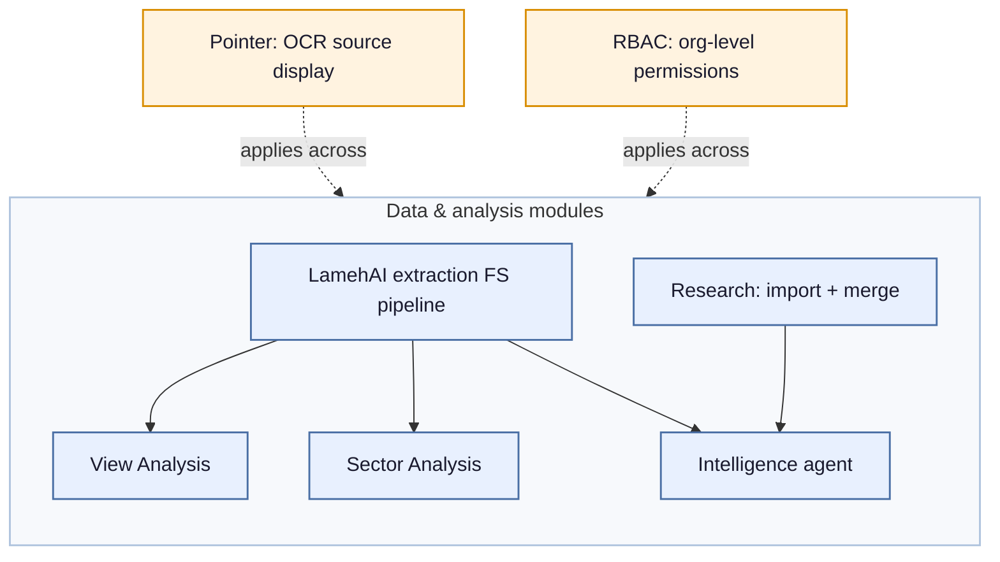

# Lameh QA Scope Map

*Updated at: 2026-07-21*

One-page inventory of what needs testing across the platform. Overview table for scanning, detail sections below for modules with enough substance to need them. Open bugs live in Linear, not here — this tracks testing approach and known risk areas, not bug status.

For more details, consult the documentation files. For more explicit/technical details, consult the technical documentation.

## Table of contents

- [Overview](#overview)
- [Component diagram](#component-diagram)
- [LamehAI Extraction FS Detail](#lamehai-extraction-fs-detail)
- [Sector Analysis Detail](#sector-analysis-detail)
- [Research Detail](#research-detail)
- [RBAC and Access Control Detail](#rbac-and-access-control-detail)
- [Intelligence Detail](#intelligence-detail)
- [Pointer Detail](#pointer-detail)
- [Open Questions to Fill In](#open-questions-to-fill-in)

## Overview

| Module | What it does | Testing type(s) | Detail |
|---|---|---|---|
| LamehAI extraction (FS) | Extracts data from board Financial Statement PDFs, verifies it, and generates a template (JSON with section/sub-section/variable names) per company. Feeds View Analysis, Sector Analysis, and Intelligence | Data accuracy (ground-truth benchmarking) | [Detail](#lamehai-extraction-fs-detail) |
| Sector Analysis | Financial ratio calculations, comparisons across companies | Functional (formulas, references, DB recalculation) | [Detail](#sector-analysis-detail) |
| Research | Import (bulk + file-by-file) board reports, process them, merge multiple board reports (3+) into comparison tables, and provide skills to an agent so it can use board report data in its process | Functional (scenarios) + data accuracy | [Detail](#research-detail) |
| RBAC / Access control | Org-level (private/public) and permission boundaries across modules | Access control (scenarios) | [Detail](#rbac-and-access-control-detail) |
| Intelligence | An agent used on the Intelligence and Research pages. On Intelligence, it uses financial statement and board report data to answer prompts; on Research, it uses financial statement and the selected board report context data to answer prompts | Functional + data accuracy + consistency | [Detail](#intelligence-detail) |
| Pointer | Uses OCR to display the exact source location where a value came from. Used in View Analysis, Intelligence, Sector Analysis, and Research to show value provenance. Implementation is not necessarily the same across each module it's used in | Functional + data accuracy | [Detail](#pointer-detail) |
| View Analysis | Displays FS data for a company; exports an Excel file containing that data across multiple sheets | ? — need input | — |

### Component diagram

*Solid arrows inside the box: data flow between modules. Dotted arrows: cross-cutting concerns that apply to every module in the box, not a data dependency with any single one.*

---

## LamehAI Extraction FS Detail

**What it does:** extracts data from board Financial Statement PDFs, verifies it, and generates a template (JSON per company containing sections, sub-sections, and variable names). Feeds View Analysis, Sector Analysis, and Intelligence.

**Detailed description:** a Financial Statement document contains 2 main parts — Main Statement and Notes.

*What the FS Pipeline does:*

Step 1 (per document process):
1. Classify pages into main statement and notes, then extract company meta-data
2. Group notes tables into groups & sub-groups
3. Translate non-English files
4. Extract main statement and process note segments, fix dates, apply number multipliers (thousand/million)

Step 2 (combine all docs into consolidated validated set):
- Generate a template (JSON containing groups/sub-groups, value names, and values per year)
- Output is a consolidated company view

See more details in the doc PDF or technical PDF.

**Known risk areas (summary):**
1. Arabic numbers translation (e.g. 5 extracted as "0", 0 as ".", 2 as 6)
2. Year classification
3. Data extraction accuracy

---

## Sector Analysis Detail

**What it does:** financial ratio calculations, comparisons across companies.

**Detailed description:** Sector Analysis uses its own template (AI-generated) containing references to the values used per company to display ratios or Main Statement values, and to compare them across companies. Formulas are pre-calculated. It also exports an Excel file that uses specific formulas to recalculate the ratios from the original values.

**Known risk areas (summary):**
1. Formulas in the web app
2. Formulas in the Excel export
3. References to values (template pointing to the correct source values) — template is AI-generated
4. The script that updates the whole DB (recalculates formulas and saves values) after a change

---

## Research Detail

**What it does:** import (bulk + file-by-file) board reports, process them, merge multiple board reports (3+) into comparison tables, and provide skills to an agent so it can use board report data in its process.

**Detailed description:** import (bulk + file-by-file) board reports. After the 3rd board report is imported and processed, merge should trigger automatically. For 4+ files imported, merge should update automatically.

**Methodology:** structured user scenarios (see scenario sheet) covering bulk import, file-by-file import, and auto-merge, run across multiple companies.

**Known risk areas (summary):**
1. Merge trigger timing — auto-merge appears bound to the file-3 upload/click event rather than file-3 processing completion, causing a race condition (merge starts before data is ready, fails with "Merge workflow v2 cancelled")
2. Extraction completeness per fiscal year — some fields (e.g. Annual Capacity, Daily Capacity, sector-specific fees) missing post-merge even when merge completes without failure; not yet confirmed whether the gap originates in source files, extraction, or mapping

---

## RBAC and Access Control Detail

**What it does:** enforces org-level (private/public) and permission boundaries across modules.

**Detailed description:** every account belongs to an organization. A public org account acts like an admin — users on a public org can upload/update companies (financial statements, board reports) that become visible to everyone, both private and public org accounts. A private org account cannot update companies uploaded by a public org account, and can upload/update companies (FS, board reports) that are only available to that specific private org.

**Known risk areas (summary):**
1. Cross-org data isolation on import/delete — public org data should stay globally visible, private org data should stay scoped to that org only

---

## Intelligence Detail

**What it does:** an agent used on the Intelligence and Research pages. On Intelligence, it uses financial statement data to answer prompts. On Research, it uses financial statement and board report data to answer prompts.

**Known risk areas (summary):**
1. Response consistency — same prompt run multiple times does not reliably produce the same result
2. Grounding/accuracy against source data — risk of answers not accurately reflecting the underlying financial statement/board report values (hallucination or misquoted figures)
3. Consistency across sessions (e.g. FCF values differing between sessions)
4. Tool call budget exhaustion

---

## Pointer Detail

**What it does:** uses OCR to display the exact source location where a value came from. Used on View Analysis, Intelligence, Sector Analysis, and Research pages to show value provenance. Implementation is not necessarily the same across each module it's used in.

**Known risk areas (summary):**
1. Source mismatch — the value shown via Pointer (OCR-read) can differ from the value displayed in the web app (FS Pipeline-processed), since the two come from different pipelines and the FS Pipeline may apply transformations (multipliers, translation, date fixes) that raw OCR does not reflect
2. OCR read accuracy — character/digit misreads, especially on low scan quality, skew, or non-English text
3. Positioning/highlighting accuracy — pointer highlighting the wrong location in the source document (bounding box misalignment), especially in multi-column or table layouts
4. Inconsistent implementation across modules — since Pointer isn't necessarily implemented the same way in View Analysis, Intelligence, Sector Analysis, and Research, behavior/coverage may vary by module and needs to be tested per module rather than assumed consistent

---

## Open questions to fill in
- Research: does the "provide skills to an agent" surface need its own known risk area — e.g. does the agent get incomplete/incorrect data if there are gaps upstream (like the FY25 missing-fields issue)? Still under investigation, testing ongoing.
