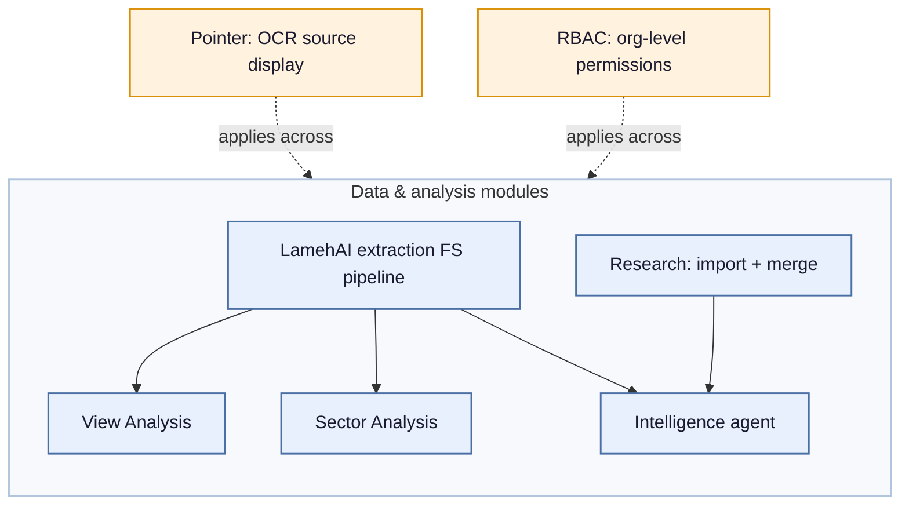

# Lameh QA Scope Map

*Updated at: 2026-08-23*

One-page inventory of what needs testing across the platform. Overview table for scanning, detail sections below for modules with enough substance to need them. Open bugs live in Linear, not here — this tracks testing approach and known risk areas, not bug status.

For more details, consult the documentation files. For more explicit/technical details, consult the technical documentation.

## Table of contents

- [Overview](#overview)
- [Component diagram](#component-diagram)
- [LamehAI Extraction FS Detail](#lamehai-extraction-fs-detail)
- [Sector Analysis Detail](#sector-analysis-detail)
- [View Analysis Detail](#view-analysis-detail)
- [Research Detail](#research-detail)
- [RBAC and Access Control Detail](#rbac-and-access-control-detail)
- [Intelligence Detail](#intelligence-detail)
- [Pointer Detail](#pointer-detail)
- [Open Questions to Fill In](#open-questions-to-fill-in)

## Overview

| Module | What it does | Testing type(s) | Detail |
|---|---|---|---|
| LamehAI extraction (FS) | Extracts data from board Financial Statement PDFs, verifies it, and generates a template (JSON with section/sub-section/variable names) per company. Feeds View Analysis, Sector Analysis, and Intelligence | Data accuracy (ground-truth benchmarking) | [Detail](#lamehai-extraction-fs-detail) |
| Sector Analysis | Financial ratio calculations, statement data, macro sector aggregates (avg/min/max/sum), custom formulas, and AI grouping/AI variables, compared across companies | Functional (formulas, references, DB recalculation) + data accuracy | [Detail](#sector-analysis-detail) |
| Research | Import (bulk + file-by-file) board reports, process them, merge multiple board reports (3+) into comparison tables, and provide skills to an agent so it can use board report data in its process | Functional (scenarios) + data accuracy | [Detail](#research-detail) |
| RBAC / Access control | Org-level (private/public) and permission boundaries across modules | Access control (scenarios) | [Detail](#rbac-and-access-control-detail) |
| Intelligence | An agent used on the Intelligence and Research pages. On Intelligence, it uses financial statement and board report data to answer prompts; on Research, it uses financial statement and the selected board report context data to answer prompts | Functional + data accuracy + consistency | [Detail](#intelligence-detail) |
| Pointer | Uses OCR to display the exact source location where a value came from. Used in View Analysis, Intelligence, Sector Analysis, and Research to show value provenance. Implementation is not necessarily the same across each module it's used in | Functional + data accuracy | [Detail](#pointer-detail) |
| View Analysis | Displays FS data for a company; allows manual value updates/accounting-error corrections (public org only); exports an Excel file containing that data across multiple sheets | Functional (value update types, export) | [Detail](#view-analysis-detail) |

### Component diagram

```mermaid
flowchart TD
    subgraph Core["Data & analysis modules"]
        direction TB
        FS[LamehAI extraction FS pipeline] --> VA[View Analysis]
        FS --> SA[Sector Analysis]
        FS --> INT[Intelligence agent]
        RES[Research: import + merge] --> INT
    end

    PTR[Pointer: OCR source display] -.applies across.-> Core
    RBAC[RBAC: org-level permissions] -.applies across.-> Core

    classDef coreNode fill:#E8F0FE,stroke:#4A6FA5,stroke-width:1.5px,color:#1A1A2E
    classDef crossNode fill:#FFF3E0,stroke:#D98E04,stroke-width:1.5px,color:#1A1A2E
    class FS,VA,SA,INT,RES coreNode
    class PTR,RBAC crossNode
    style Core fill:#F7F9FC,stroke:#B0C4DE,stroke-width:1.5px
```

*Solid arrows inside the box: data flow between modules. Dotted arrows: cross-cutting concerns that apply to every module in the box, not a data dependency with any single one.*

---

## LamehAI Extraction FS Detail

**What it does:** extracts data from board Financial Statement PDFs, verifies it, and generates a template (JSON per company containing sections, sub-sections, and variable names). Feeds View Analysis, Sector Analysis, and Intelligence.

**Detailed description:** a Financial Statement document contains 2 main parts — Main Statement and Notes.

*What the FS Pipeline does:*

Step 1 (per document process):
1. Classify pages into main statement and notes, then extract company meta-data
2. Group notes tables into groups & sub-groups
3. Translate non-English files
4. Extract main statement and process note segments, fix dates, apply number multipliers (thousand/million)

Step 2 (combine all docs into consolidated validated set):
- Generate a template (JSON containing groups/sub-groups, value names, and values per year)
- Output is a consolidated company view

See more details in the doc PDF or technical PDF.

**Known risk areas (summary):**
1. Arabic numbers translation (e.g. 5 extracted as "0", 0 as ".", 2 as 6)
2. Year classification
3. Data extraction accuracy

---

## Sector Analysis Detail

**What it does:** financial ratio calculations, statement data display, macro
sector aggregates, and user-built metrics (custom formulas, AI grouping/AI
variables), compared across companies.

**Detailed description:** Sector Analysis uses its own template (AI-generated) containing references to the values used per company to display ratios or Main Statement values, and to compare them across companies. Formulas are pre-calculated. It also exports an Excel file that uses specific formulas to recalculate the ratios from the original values.

### What is testable

| Area | What it is |
|---|---|
| Ratios | The financial ratios, pre-calculated per company and recomputable from the export's own inputs |
| Statement data | Main Statement line items displayed directly, not derived — must match the FS data behind them |
| Macro sector | Aggregates across the selected companies: average, min, max, sum |
| Custom formulas | A user-defined formula built on top of the available values |
| AI grouping / AI variables | AI-created groupings and variables rather than template-defined ones |
| Market data | Market/valuation data |
| Commodity data | Commodity data |

Ratio verification is automated — see
[`AGENT.md`](AGENT.md) for `tests/integration/sector_analysis_ratios.py` and the
five-step audit pipeline around it. The other six areas are not covered by it.

**Known risk areas (summary):**
1. Formulas in the web app
2. Formulas in the Excel export
3. References to values (template pointing to the correct source values) — template is AI-generated
4. The script that updates the whole DB (recalculates formulas and saves values) after a change
5. Statement data — the displayed line items matching the FS source (and matching what View Analysis shows for the same company)
6. Macro sector aggregates — whether avg/min/max/sum are computed over the right set of companies and periods, and how they treat companies with a missing value (skipped vs counted as 0)
7. Custom formulas — whether a user-built formula evaluates correctly, persists, and recalculates after an underlying value changes
8. AI grouping / AI variables — AI-generated, so the same accuracy risk as the AI-generated template: wrong grouping, wrong value picked for a variable
9. Market data — missing entirely in a particular environment (present in one of DEV/UAT/CORE but not the others), and valuation figures not being updated
10. Commodity data — no known risk area recorded yet, see [open questions](#open-questions-to-fill-in)

---

## View Analysis Detail

**What it does:** displays FS data for a company, lets a public-org user correct
values manually, and exports the displayed data to Excel.

### 1. Manual value update / accounting-error correction

**Scope:** public org accounts only — a private org account cannot update
values on a company uploaded by a public org (see
[RBAC](#rbac-and-access-control-detail)).

Any displayed value can be updated. There are four types of update to cover:

| # | Update type | What it means |
|---|---|---|
| 1 | Normal value | The cell already holds a value and it is replaced with a new one |
| 2 | Null value, no file uploaded | The cell is empty and no source document backs it |
| 3 | Null value, file uploaded | The cell is empty but a source document exists for it |
| 4 | Validation value | A sub-value of another value, used to check whether that parent value is correct |

**Methodology:** run each of the four update types per company, and check both
what View Analysis shows afterwards and what the downstream modules show —
an updated value feeds Sector Analysis, Intelligence, and the Excel export, so
the update is only correct if it propagates.

**Known risk areas (summary):**
1. Update propagation — a corrected value must reach Sector Analysis (which
   recalculates ratios from it), Intelligence, and the Excel export, not just
   the View Analysis screen
2. The null cases (types 2 and 3) — whether the app distinguishes "no value"
   from "no source document", and whether an update behaves the same with and
   without a file behind the cell
3. Validation values — updating a sub-value used to check its parent: whether
   the parent still reconciles afterwards, and what the app does when the two
   disagree
4. Org boundary — a private org account must not be able to update a
   public-org company's values
5. Visibility to private orgs — an update made by a public org must be visible
   to private org accounts, not just within the org that made it

### 2. Export to Excel

**What it does:** a button on View Analysis exports the company's FS data into
an Excel file spread across multiple sheets.

**Expected behavior:** the button works for **every** company — no company
should fail to export, produce an empty/partial workbook, or hang.

**Methodology:** export across the full company list rather than a sample,
since the failure mode is expected to be company-specific.

**Known risk areas (summary):**
1. Companies where the export fails or times out

---

## Research Detail

**What it does:** import (bulk + file-by-file) board reports, process them, merge multiple board reports (3+) into comparison tables, and provide skills to an agent so it can use board report data in its process.

**Detailed description:** import (bulk + file-by-file) board reports. After the 3rd board report is imported and processed, merge should trigger automatically. For 4+ files imported, merge should update automatically.

**Methodology:** structured user scenarios (see scenario sheet) covering bulk import, file-by-file import, and auto-merge, run across multiple companies.

**Known risk areas (summary):**
1. Merge trigger timing — auto-merge appears bound to the file-3 upload/click event rather than file-3 processing completion, causing a race condition (merge starts before data is ready, fails with "Merge workflow v2 cancelled")
2. Extraction completeness per fiscal year — some fields (e.g. Annual Capacity, Daily Capacity, sector-specific fees) missing post-merge even when merge completes without failure; not yet confirmed whether the gap originates in source files, extraction, or mapping

---

## RBAC and Access Control Detail

**What it does:** enforces org-level (private/public) and permission boundaries across modules.

**Detailed description:** every account belongs to an organization. A public org account acts like an admin — users on a public org can upload/update companies (financial statements, board reports) that become visible to everyone, both private and public org accounts. A private org account cannot update companies uploaded by a public org account, and can upload/update companies (FS, board reports) that are only available to that specific private org.

**Known risk areas (summary):**
1. Cross-org data isolation on import/delete — public org data should stay globally visible, private org data should stay scoped to that org only

---

## Intelligence Detail

**What it does:** an agent used on the Intelligence and Research pages. On Intelligence, it uses financial statement data to answer prompts. On Research, it uses financial statement and board report data to answer prompts.

**Known risk areas (summary):**
1. Response consistency — same prompt run multiple times does not reliably produce the same result
2. Grounding/accuracy against source data — risk of answers not accurately reflecting the underlying financial statement/board report values (hallucination or misquoted figures)
3. Consistency across sessions (e.g. FCF values differing between sessions)
4. Tool call budget exhaustion

---

## Pointer Detail

**What it does:** uses OCR to display the exact source location where a value came from. Used on View Analysis, Intelligence, Sector Analysis, and Research pages to show value provenance. Implementation is not necessarily the same across each module it's used in.

**Known risk areas (summary):**
1. Source mismatch — the value shown via Pointer (OCR-read) can differ from the value displayed in the web app (FS Pipeline-processed), since the two come from different pipelines and the FS Pipeline may apply transformations (multipliers, translation, date fixes) that raw OCR does not reflect
2. OCR read accuracy — character/digit misreads, especially on low scan quality, skew, or non-English text
3. Positioning/highlighting accuracy — pointer highlighting the wrong location in the source document (bounding box misalignment), especially in multi-column or table layouts
4. Inconsistent implementation across modules — since Pointer isn't necessarily implemented the same way in View Analysis, Intelligence, Sector Analysis, and Research, behavior/coverage may vary by module and needs to be tested per module rather than assumed consistent

---

## Open questions to fill in
- Sector Analysis: what are the known risk areas for commodity data? Market data has two (environment gaps, stale valuations); commodity data has none recorded.
- Research: does the "provide skills to an agent" surface need its own known risk area — e.g. does the agent get incomplete/incorrect data if there are gaps upstream (like the FY25 missing-fields issue)? Still under investigation, testing ongoing.
